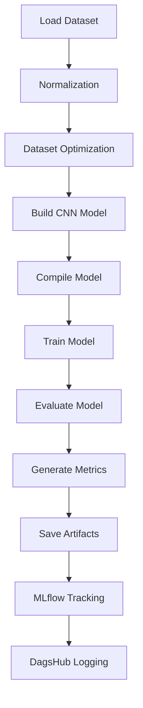
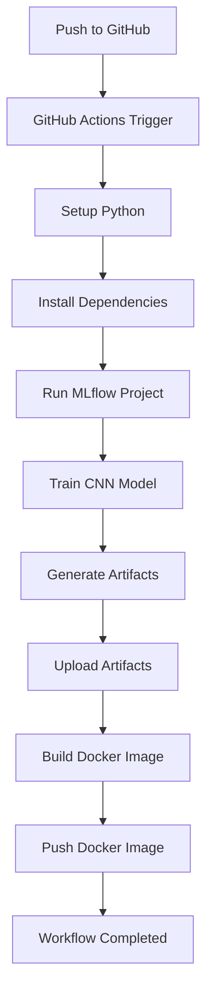
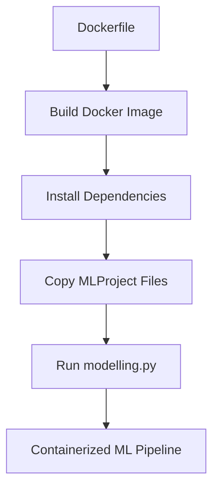

# README.md

# Intel Image Classification with MLflow CI/CD Pipeline

## Project Overview

Project ini merupakan implementasi pipeline Machine Learning end-to-end untuk klasifikasi gambar menggunakan Convolutional Neural Network (CNN), MLflow Tracking, DagsHub, GitHub Actions, dan Docker.

Project dibuat untuk memenuhi:

- Kriteria 1 — Experimentation & Preprocessing
- Kriteria 2 — Modelling & MLflow Tracking
- Kriteria 3 — Workflow CI/CD

Dataset yang digunakan:

- Intel Image Classification Dataset

Kategori klasifikasi:

1. Buildings
2. Forest
3. Glacier
4. Mountain
5. Sea
6. Street

---

# Objectives

Project ini bertujuan untuk:

- Melakukan preprocessing dataset gambar secara otomatis
- Melatih model CNN untuk klasifikasi gambar
- Melakukan tracking experiment menggunakan MLflow
- Menyimpan artifacts model
- Mengintegrasikan DagsHub
- Membuat CI/CD workflow menggunakan GitHub Actions
- Membuat Docker Image otomatis

---

# Tech Stack

| Technology     | Usage                   |
| -------------- | ----------------------- |
| Python         | Programming Language    |
| TensorFlow     | Deep Learning Framework |
| MLflow         | Experiment Tracking     |
| DagsHub        | Remote MLflow Tracking  |
| GitHub Actions | CI/CD Automation        |
| Docker         | Containerization        |
| Matplotlib     | Visualization           |
| Scikit-Learn   | Evaluation Metrics      |

---

# Project Structure

````text
Workflow-CI/
│
├── .github/
│   └── workflows/
│       └── ci.yml
│
├── MLProject/
│   │
│   ├── artifacts/
│   │   ├── classification_report.txt
│   │   ├── cnn_model.keras
│   │   ├── confusion_matrix.png
│   │   ├── model_summary.txt
│   │   └── training_history.png
│   │
│   ├── intel_image_preprocessing/
│   │   ├── train/
│   │   ├── val/
│   │   └── test/
│   │
│   ├── conda.yaml
│   ├── Dockerfile
│   ├── DagsHub.txt
│   ├── MLproject
│   ├── modelling.py
│   └── requirements.txt
│
├── README.md
└── .gitignore


---

# Dataset Flow

```mermaid
graph TD

A[Raw Dataset] --> B[Data Loading]

B --> C[Exploratory Data Analysis]

C --> D[Data Cleaning]

D --> E[Dataset Splitting]

E --> F[Train Dataset]

E --> G[Validation Dataset]

E --> H[Test Dataset]

F --> I[Normalization]

G --> I

H --> I

I --> J[Dataset Optimization]

J --> K[Preprocessed Dataset]
````

---

# CNN Architecture

```mermaid
graph TD

A[Input Image 128x128x3]

A --> B[Conv2D 32 Filters]

B --> C[MaxPooling2D]

C --> D[Conv2D 64 Filters]

D --> E[MaxPooling2D]

E --> F[Flatten]

F --> G[Dense 128]

G --> H[Dropout 0.3]

H --> I[Dense Softmax 6 Classes]

I --> J[Prediction Output]
```

---

# MLflow Training Flow



---

# CI/CD Workflow



---

# Docker Workflow



---

# MLflow Artifacts

Artifacts yang dihasilkan:

| Artifact                  | Description                     |
| ------------------------- | ------------------------------- |
| cnn_model.keras           | Trained CNN Model               |
| training_history.png      | Training Accuracy Visualization |
| confusion_matrix.png      | Evaluation Matrix               |
| classification_report.txt | Precision, Recall, F1-score     |
| model_summary.txt         | CNN Architecture Summary        |

---

# MLflow Metrics

Metrics yang dicatat:

| Metric        |
| ------------- |
| accuracy      |
| val_accuracy  |
| test_accuracy |
| loss          |
| val_loss      |
| test_loss     |

---

# How To Run Locally

## 1. Clone Repository

```bash
git clone <repository-url>
```

---

## 2. Move to Project

```bash
cd Workflow-CI/MLProject
```

---

## 3. Install Dependencies

```bash
pip install -r requirements.txt
```

---

## 4. Run Training

```bash
python modelling.py
```

---

# Run MLflow Project

```bash
mlflow run .
```

---

# Run GitHub Actions

Workflow otomatis berjalan ketika:

- push ke branch main
- workflow_dispatch dijalankan

---

# Run Docker Container

## Build Docker Image

```bash
docker build -t intel-image-classification .
```

---

## Run Docker Container

```bash
docker run intel-image-classification
```

---

# DagsHub Integration

Project menggunakan DagsHub untuk:

- remote experiment tracking
- remote artifact storage
- model versioning

Repository DagsHub:

```text
https://dagshub.com/arif76440/MLFlow-Image-Classification
```

---

# Docker Hub

Docker Image:

```text
https://hub.docker.com/
```

---

# GitHub Actions Workflow

Workflow:

- setup environment
- install dependencies
- retrain model automatically
- upload artifacts
- build docker image
- push docker image

---

# Model Performance

| Metric        | Value |
| ------------- | ----- |
| Test Accuracy | ~78%  |
| Test Loss     | ~0.72 |

---

# Future Improvements

- Hyperparameter tuning
- Transfer Learning
- Model Deployment
- Model Registry
- Real-time Inference API

---

# Author

Muh Arifandi

---

# License

This project is developed for educational purposes.
