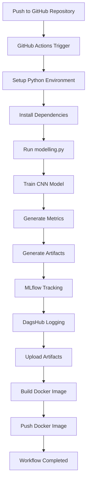
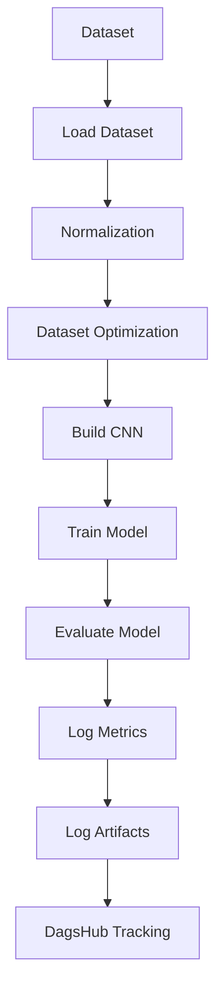
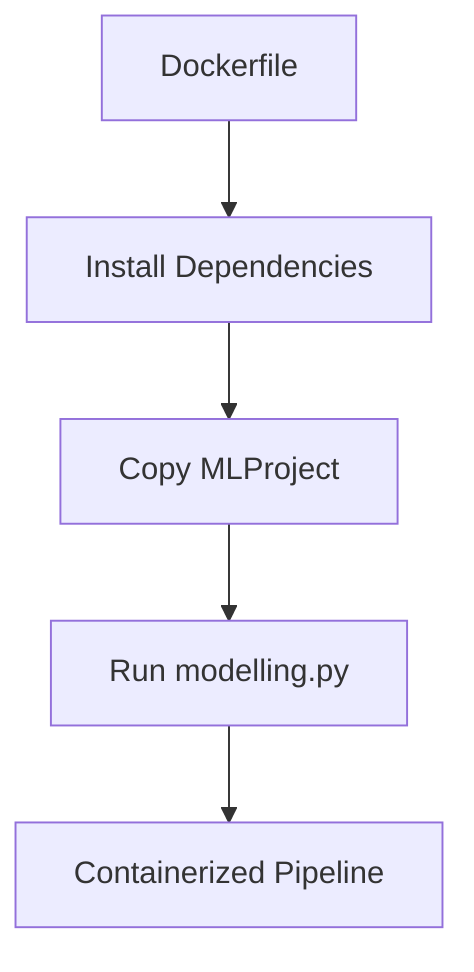
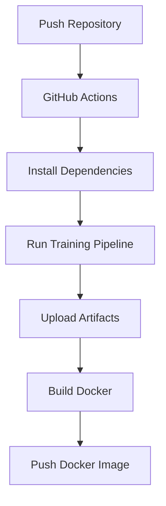

# Workflow CI/CD MLflow Project

## Project Overview

Project ini merupakan implementasi Workflow CI/CD untuk Machine Learning menggunakan:

- MLflow Project
- GitHub Actions
- DagsHub
- Docker

Pipeline dibuat untuk melakukan:

- retraining model otomatis,
- experiment tracking,
- artifact logging,
- Docker image build,
- Docker image push secara otomatis.

---

# Objectives

Tujuan utama project:

- Membuat automation workflow menggunakan GitHub Actions
- Menjalankan training model otomatis ketika repository di-push
- Melakukan experiment tracking menggunakan MLflow
- Menyimpan artifact training
- Mengintegrasikan DagsHub
- Membuat Docker image otomatis

---

# Technologies Used

| Technology     | Function                |
| -------------- | ----------------------- |
| Python         | Programming Language    |
| TensorFlow     | Deep Learning Framework |
| MLflow         | Experiment Tracking     |
| DagsHub        | Remote MLflow Tracking  |
| GitHub Actions | Workflow Automation     |
| Docker         | Containerization        |

---

# Project Structure

```text
Workflow-CI/
│
├── .github/
│   └── workflows/
│       └── ci.yml
│
├── MLProject/
│   │
│   ├── artifacts/
│   │   ├── classification_report.txt
│   │   ├── cnn_model.keras
│   │   ├── confusion_matrix.png
│   │   ├── model_summary.txt
│   │   └── training_history.png
│   │
│   ├── intel_image_preprocessing/
│   │   ├── train/
│   │   ├── val/
│   │   └── test/
│   │
│   ├── modelling.py
│   ├── MLproject
│   ├── python_env.yaml
│   ├── conda.yaml
│   ├── Dockerfile
│   └── requirements.txt
│
├── README.md
└── .gitignore
```

---

# Workflow CI/CD Architecture



---

# MLflow Workflow



---

# Docker Workflow



---

# Artifacts Generated

Artifacts yang dihasilkan selama workflow berjalan:

| Artifact                  | Description            |
| ------------------------- | ---------------------- |
| cnn_model.keras           | Trained CNN Model      |
| training_history.png      | Training Visualization |
| confusion_matrix.png      | Confusion Matrix       |
| classification_report.txt | Classification Metrics |
| model_summary.txt         | CNN Model Architecture |

---

# Metrics Logged

MLflow mencatat:

| Metrics       |
| ------------- |
| accuracy      |
| val_accuracy  |
| test_accuracy |
| loss          |
| val_loss      |
| test_loss     |

---

# MLflow Project Configuration

## MLproject

```yaml
name: Intel_Image_Classification

python_env: python_env.yaml

entry_points:
  main:
    command: "python modelling.py"
```

---

# Python Environment

## python_env.yaml

```yaml
python: "3.10"

build_dependencies:
  - pip

dependencies:
  - tensorflow
  - mlflow
  - dagshub
  - numpy
  - matplotlib
  - scikit-learn
  - pillow
```

---

# GitHub Actions Workflow

Workflow otomatis berjalan ketika:

- push ke branch `main`
- workflow_dispatch dijalankan

---

# GitHub Actions Pipeline



---

# Docker Configuration

## Dockerfile

```dockerfile
FROM python:3.10

WORKDIR /app

COPY . .

RUN pip install --no-cache-dir -r requirements.txt

CMD ["python", "modelling.py"]
```

---

# DagsHub Integration

Project menggunakan DagsHub untuk:

- remote experiment tracking,
- remote metrics logging,
- remote artifact logging.

DagsHub Repository:

```text
https://dagshub.com/arif76440/MLFlow-Image-Classification
```

---

# GitHub Secrets

Secrets yang digunakan:

| Secret          | Function               |
| --------------- | ---------------------- |
| DAGSHUB_TOKEN   | Authentication DagsHub |
| DOCKER_USERNAME | DockerHub Username     |
| DOCKER_PASSWORD | DockerHub Access Token |

---

# How To Run Locally

## Install Dependencies

```bash
pip install -r requirements.txt
```

---

## Run Training

```bash
python modelling.py
```

---

# How To Run Workflow

Workflow otomatis berjalan ketika:

- push ke GitHub repository,
- atau menjalankan workflow_dispatch.

---

# Build Docker Image

```bash
docker build -t intel-image-classification .
```

---

# Run Docker Container

```bash
docker run intel-image-classification
```

---

# Expected Output

Workflow akan menghasilkan:

- trained CNN model,
- MLflow tracking,
- DagsHub logging,
- uploaded artifacts,
- Docker image.

---

# Author

Muh Arifandi
